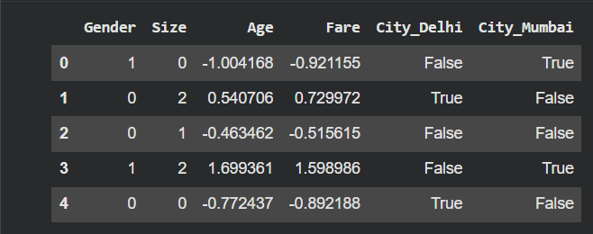

#  Passenger Data Preprocessing

##  Objective
To convert raw passenger data into a machine-learning-ready format using encoding and feature scaling techniques.

---

## 📊 Dataset
Contains:
- Gender
- City
- Size
- Age
- Fare (with outlier)

---

## ⚙️ Techniques Used

- **Label Encoding** → Gender
- **One-Hot Encoding** → City (with drop to avoid dummy trap)
- **Ordinal Encoding** → Size (Small=0, Medium=1, Large=2)
- **Feature Scaling** → Age & Fare using StandardScaler

---

##  Key Insight
Encoding converts categorical data into numeric form, and scaling ensures all features contribute equally to the model.

---

## Screenshot Output

---

## 📁 Files
- `passenger_encoding_scaling.ipynb`
- `screenshot.png`
- `README.md`

---

## ✅ Result
Data successfully preprocessed and made ready for machine learning models.

---

##  Author
ML Data Preprocessing Assignment
